# 🚀 device_systems

API REST desarrollada con **Python y FastAPI** para la gestión de usuarios.

Proyecto realizado como evidencia de aprendizaje del **SENA – GA1-220501096-01-AA1-EV07: Fundamentos de FastAPI**.

## 🛠️ Tecnologías

* Python
* FastAPI
* Pydantic v2
* Uvicorn
* Swagger UI
* Git y GitHub

## 📁 Estructura

```text
device_systems/
├── app/
│   ├── main.py
│   ├── schemas/
│   │   └── user_schema.py
│   └── routes/
│       └── user_routes.py
├── requirements.txt
└── README.md
```


## 👤 Usuarios

Cada usuario contiene:

* `id`
* `name`
* `email`
* `role`
* `is_active`

Roles permitidos:

* `admin`
* `support`
* `user`

## 🔗 Endpoints

| Método | Endpoint                | Función               |
| ------ | ----------------------- | --------------------- |
| GET    | `/users`                | Listar usuarios       |
| GET    | `/users/{user_id}`      | Buscar usuario por ID |
| GET    | `/users?role=admin`     | Filtrar por rol       |
| GET    | `/users?is_active=true` | Filtrar por estado    |
| POST   | `/users`                | Crear usuario         |

## ✅ Validaciones

La API utiliza **Pydantic v2** para validar:

* Nombre mínimo de 3 caracteres.
* Formato del correo electrónico.
* Roles permitidos.
* Estado activo/inactivo.
* Correos electrónicos duplicados.

También se implementan **Response Models** y cabeceras HTTP personalizadas:

```text
X-App-Name: device_systems
X-API-Version: 1.0
```

## 📸 Evidencias

### Swagger UI

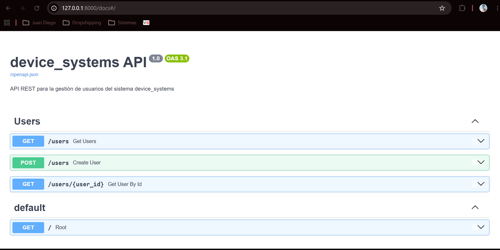

### GET /users

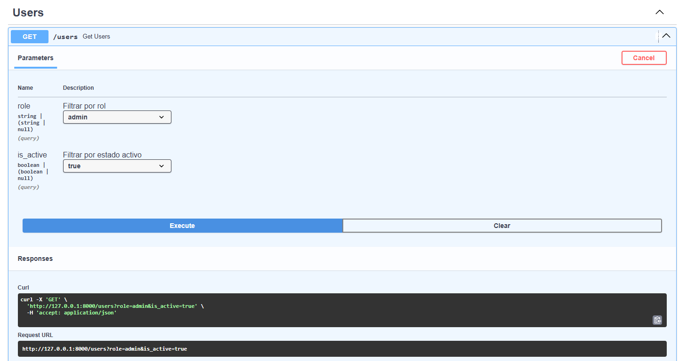
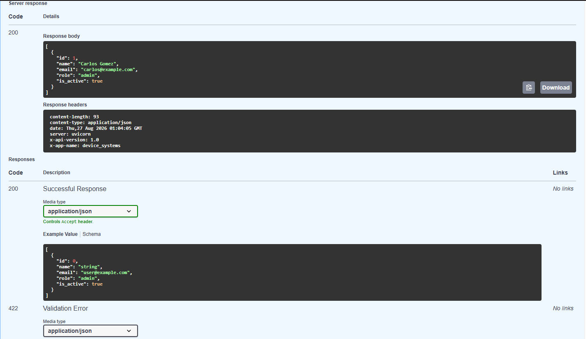
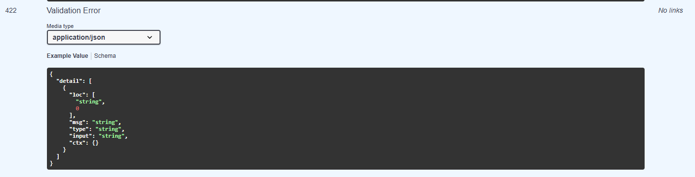

### GET /users/{user_id}

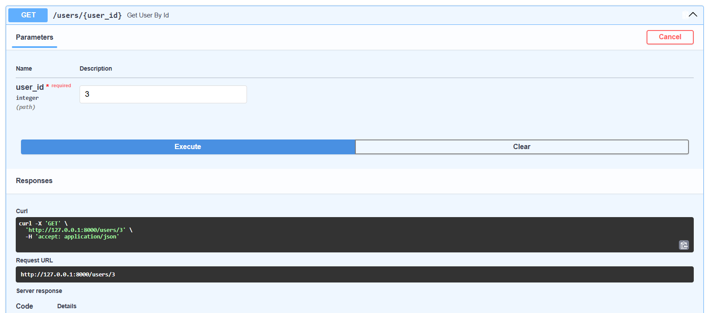
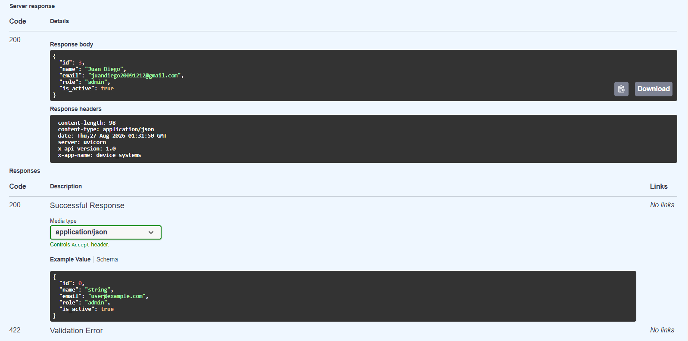
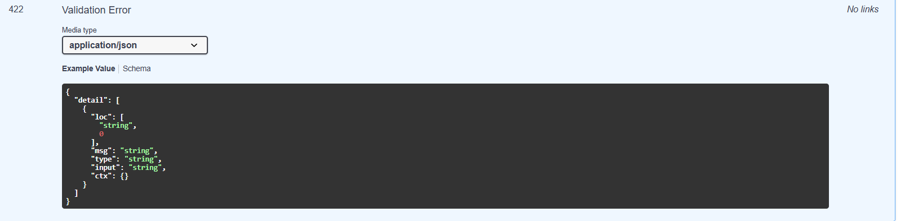


### POST /users

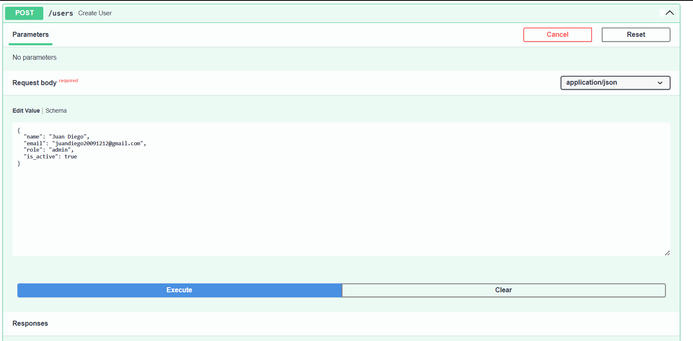
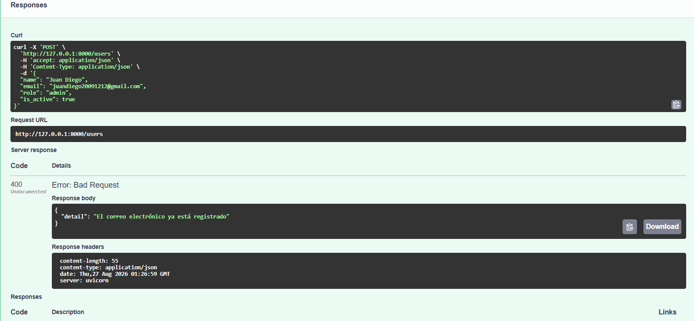
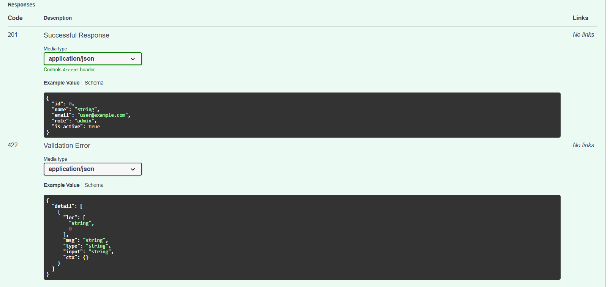

### Validaciones

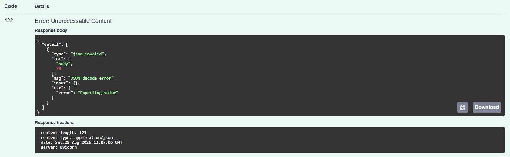
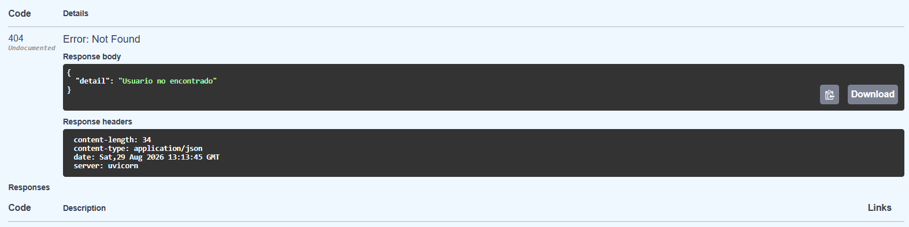

### Video explicativo

https://youtu.be/Hp2yHmV1nTE

## 👨‍💻 Autor

**Juan Diego Tabares Ospina**

**SENA – GA1-220501096-01-AA1-EV07**
